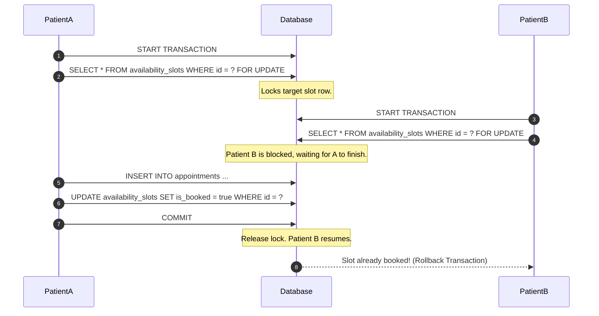
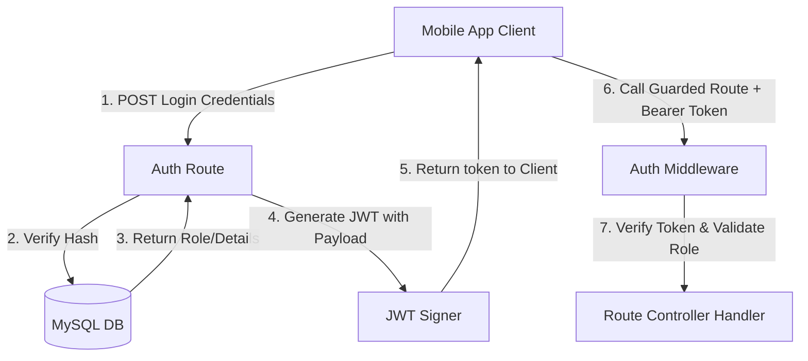

# 🏥 MediBook — Backend API

MediBook is a production-grade, highly scalable REST API built using **Node.js**, **Express**, and **MySQL**. It powers a real-time doctor-patient appointment booking engine, implementing robust authentication, transactional safety, and comprehensive database structures.

---

## 📁 Repository Structure & Module Breakdown

```
backend/
├── src/
│   ├── config/
│   │   ├── database.js     # MySQL2 connection pooling configuration
│   │   └── swagger.js      # OpenAPI Spec (Swagger) setup for endpoint testing
│   ├── controllers/
│   │   ├── authController.js   # JWT generation, hash validation, and login routines
│   │   ├── doctorController.js # Slot CRUD, doctor-specific schedules, status workflows
│   │   └── patientController.js# Concurrency-safe appointment bookings, cancellations
│   ├── database/
│   │   ├── migrate.js      # Schema creation script (relational DDL queries)
│   │   └── seed.js         # Faker/JS script to populate 2,000 entities & slots
│   ├── middleware/
│   │   ├── auth.js         # JWT interceptor and Role-Based Access Control (RBAC)
│   │   └── validate.js     # Payload parser validating incoming parameters
│   ├── routes/
│   │   ├── authRoutes.js   # /api/auth routing namespace
│   │   ├── doctorRoutes.js # /api/doctors routing namespace
│   │   └── patientRoutes.js# /api/patients routing namespace
│   ├── utils/
│   │   ├── jwt.js          # Tokens signer and encoder utils
│   │   └── response.js     # Unified format responder wrapper
│   └── server.js           # Server initializer, global middleware stacks
├── .env
├── package.json
└── .github/
    └── workflows/
        └── ci-cd.yml       # GitHub Actions workflow script
```

---

## ⚙️ Core Architecture & Architecture Workflows

### 1. Concurrency-Safe Booking Engine
To prevent double-booking issues when multiple patients attempt to book the exact same slot at the same microsecond, the booking engine utilizes **MySQL Transaction isolation levels** combined with **Row-Level locks** (`FOR UPDATE`).



### 2. Authentication & Authorization Workflow
We use **JWT (JSON Web Tokens)** for stateless session management. Users can sign in as either a doctor or a patient. Role-Based Access Control (RBAC) checks the requested path against the user's role.



---

## 🔌 Complete REST API Endpoint Specification

All listing endpoints support query parameters for pagination:
* `page` (Default: `1`)
* `limit` (Default: `15`, Maximum: `100`)

### 🔐 Authentication namespace (`/api/auth`)

#### `POST /api/auth/login`
Authenticates a user and returns a token with user/profile information.
* **Payload:**
  ```json
  {
    "email": "demo.patient@medical.com",
    "password": "password123"
  }
  ```
* **Success Response (200 OK):**
  ```json
  {
    "status": "success",
    "data": {
      "token": "eyJhbGciOi...",
      "user": {
        "id": 1,
        "email": "demo.patient@medical.com",
        "role": "patient",
        "full_name": "John Doe"
      },
      "profile": {
        "id": 1,
        "gender": "Male",
        "blood_group": "O+"
      }
    }
  }
  ```

#### `GET /api/auth/me`
*Headers: `Authorization: Bearer <token>`*
Returns current user context.

---

### 🩺 Public Doctor Directory (`/api/doctors`)

#### `GET /api/doctors`
Searches doctor database profiles using optional filters.
* **Query Parameters:** `name`, `specialization`, `date`, `page`, `limit`
* **Success Response (200 OK):**
  ```json
  {
    "status": "success",
    "data": [
      {
        "id": 1,
        "full_name": "Dr. Sarah Connor",
        "specialization": "Cardiology",
        "hospital_name": "City General Hospital",
        "consultation_fee": 150.00,
        "rating": 4.8
      }
    ],
    "pagination": {
      "total": 120,
      "page": 1,
      "limit": 1,
      "totalPages": 120,
      "hasNext": true
    }
  }
  ```

#### `GET /api/doctors/:id`
Retrieves full information for a single doctor.

#### `GET /api/doctors/:id/slots`
Retrieves available, unbooked slots for a doctor.

---

### 👨‍⚕️ Doctor Portal Namespace (`/api/doctors/me`)
*Headers: `Authorization: Bearer <doctor_token>`*

#### `GET /api/doctors/me/appointments`
Returns list of patients booked with the authenticated doctor. Supports filtering by `status` (`pending`, `confirmed`, `completed`, `cancelled`).

#### `POST /api/doctors/me/slots`
Registers availability. Accepts a single slot object or a bulk array of slots.
* **Payload (Bulk):**
  ```json
  {
    "slots": [
      { "slot_date": "2024-12-25", "start_time": "09:00", "end_time": "09:30" },
      { "slot_date": "2024-12-25", "start_time": "09:30", "end_time": "10:00" }
    ]
  }
  ```

#### `PUT /api/doctors/me/appointments/:id/status`
Updates appointment status.
* **Payload:**
  ```json
  {
    "status": "confirmed" // confirmed, completed, cancelled
  }
  ```

---

### 🧑‍💼 Patient Portal Namespace (`/api/patients`)
*Headers: `Authorization: Bearer <patient_token>`*

#### `POST /api/patients/appointments`
Books an appointment.
* **Payload:**
  ```json
  {
    "slot_id": 482,
    "notes": "Experiencing recurring headaches"
  }
  ```

#### `PUT /api/patients/appointments/:id/cancel`
Cancels an appointment.

---

## 🛠️ Installation & Execution

### Setup Environment
Configure `/backend/.env` file with the parameters described in standard config section.

### Launch Application
```bash
# Install dependencies
npm install

# Run database setup
npm run migrate
npm run seed

# Run server in hot-reload development mode
npm run dev
```

---

## 📦 CI/CD Pipeline Workflow (GitHub Actions)

This repository includes a pipeline script (`.github/workflows/ci-cd.yml`). Here is the step-by-step CI flow:

1. **Spin up MySQL Service Container**: Launches an ephemeral Docker service container hosting MySQL 8.0 with preconfigured credentials matching testing env.
2. **Setup Node Runner**: Configures virtual environment runners on Ubuntu with Node.js v18.
3. **Syntax Validation Check**: Runs syntax parsing (`node --check`) to verify there are no compilation errors in JS scripts.
4. **Environment Initialization**: Appends testing configurations to `.env`.
5. **Database DDL Testing**: Executes database migration scripts against the MySQL Docker service.
6. **Data Injection Verification**: Runs the seeder module to ensure mock data generation scripts execute correctly.


<!-- 👨‍⚕️ Doctor Portal Login:
Email: arjun.sharma1@gmail.com
Password: password123
Name: Dr. Arjun Sharma
🧑‍💼 Patient Portal Login:
Email: rajesh.mehta1001@gmail.com
Password: password123
Name: Rajesh Mehta -->