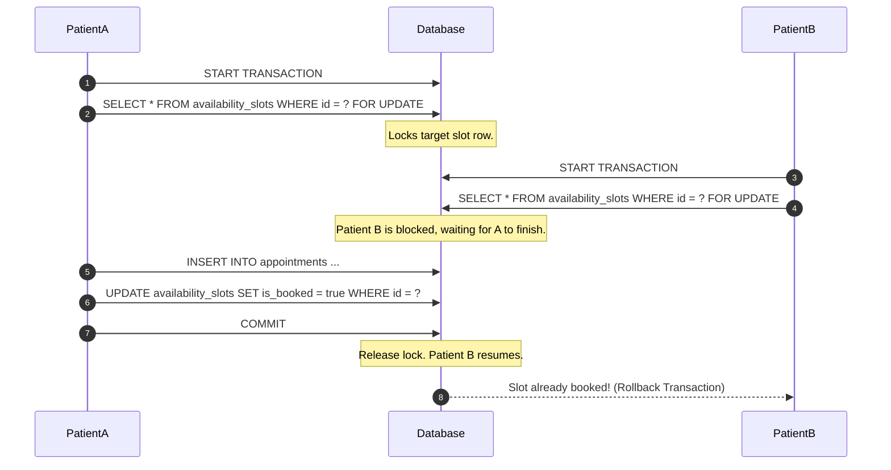
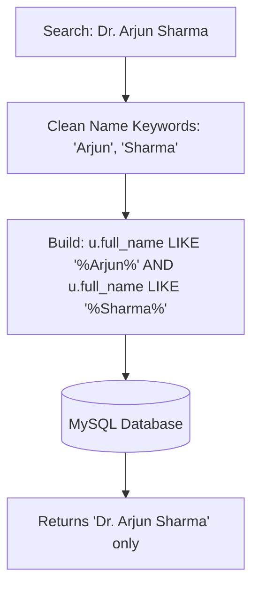

# 🏥 Booking Kro — Backend API (Express & MySQL)

Booking Kro is a production-grade, highly scalable REST API built using **Node.js**, **Express**, and **MySQL**. It powers a real-time doctor-patient appointment booking engine, implementing robust authentication, transactional safety, and comprehensive database structures.

---

## 📁 Repository Structure & Module Breakdown

```
backend/
├── src/
│   ├── config/
│   │   ├── database.js     # MySQL2 connection pooling configuration
│   │   └── swagger.js      # OpenAPI Spec (Swagger) setup for endpoint testing
│   ├── controllers/
│   │   ├── authController.js   # JWT generation, hash validation, and login routines
│   │   ├── doctorController.js # Slot CRUD, keyword-split matching search algorithms
│   │   └── patientController.js# Concurrency-safe appointment bookings, cancellations
│   ├── database/
│   │   ├── migrate.js      # Schema creation script (relational DDL queries)
│   │   └── seed.js         # Faker/JS script to populate database entities
│   ├── middleware/
│   │   ├── auth.js         # JWT interceptor and Role-Based Access Control (RBAC)
│   │   └── validate.js     # Payload parser validating incoming parameters
│   ├── routes/
│   │   ├── authRoutes.js   # /api/auth routing namespace
│   │   ├── doctorRoutes.js # /api/doctors routing namespace
│   │   └── patientRoutes.js# /api/patients routing namespace
│   ├── utils/
│   │   ├── jwt.js          # Tokens signer and encoder utils
│   │   └── response.js     # Unified format responder wrapper
│   └── server.js           # Server initializer, global middleware stacks
├── .env
└── package.json
```

---

## ⚙️ Core Architecture & Database Workflows

### 1. Concurrency-Safe Booking Engine
To prevent double-booking issues when multiple patients attempt to book the exact same slot at the same microsecond, the booking engine utilizes **MySQL Transaction isolation levels** combined with **Row-Level locks** (`FOR UPDATE`).



### 2. Keyword-Based Multi-Word Search matching
The search API splits user query inputs (e.g. `Arjun Sharma`), filters out generic pre-fixes like `Dr.` / `Dr.`, and converts search keywords into strict SQL `LIKE` criteria matching all terms.



---

## 🛠️ Tech Stack & Middleware

* **Core**: Node.js & Express.js
* **Database**: MySQL (Using `mysql2/promise` pooling)
* **Auth**: JSON Web Tokens (JWT) & bcryptjs hashing
* **Validation**: `express-validator` middleware
* **Documentation**: Swagger UI & OpenAPI

---

## 🔌 API Namespace Endpoints

### 🔐 Authentication namespace (`/api/auth`)
* `POST /api/auth/login` - Authenticates user credentials and returns JWT token.

### 👨‍⚕️ Doctor namespace (`/api/doctors`)
* `GET /api/doctors` - Fetches doctor lists with pagination (supports `name`, `specialization`, `date` filters).
* `GET /api/doctors/specializations` - Retrieves all unique medical department specializations.
* `GET /api/doctors/:id/slots` - Fetches available booking slots for a selected doctor.

---

## 🚀 Execution & Setup

1. **Configure Environment Variables**:
   Create a `.env` file in the backend root directory:
   ```env
   PORT=5001
   DB_HOST=127.0.0.1
   DB_USER=root
   DB_PASSWORD=your_password
   DB_NAME=medibook
   JWT_SECRET=super_secret_jwt_token_key
   ```

2. **Run Server**:
   ```bash
   # Install dependencies
   npm install

   # Setup database schemas and tables
   npm run migrate

   # Seed database with dummy doctors and slots
   # This generates 2,000 Indian doctors, 2,000 Indian patients, and 30 days of availability slots!
   npm run seed

   # Start backend service
   npm start
   ```

### 🌱 Database Seeding Specification
The seeder script (`src/database/seed.js`) populates a robust set of authentic test data matching Indian medical operations:
* **Doctors**: 2,000 profiles with names like `Arjun Sharma`, `Priya Reddy`, mapped to leading hospitals (`Apollo Hospitals`, `KIMS`, `Manipal Hospitals`).
* **Patients**: 2,000 profiles with unique age parameters, blood groups, and medical histories.
* **Slots**: Pre-generates 30 days of future time slots (30-minute intervals from 9:00 AM to 6:00 PM) for the first 50 doctors to ensure rich availability lists during client UI testing.

---

## 📖 Swagger Interactive API Documentation Testing
Interactively test and verify the REST API endpoints inside your browser:

### 1. Access Swagger UI Page
1. Ensure the Node backend server is running (`npm start`).
2. Open your browser and navigate to: **`http://localhost:5001/api/docs`**

### 2. Authentication Walkthrough (Swagger Console)
1. Locate and expand the **`POST /api/auth/login`** row.
2. Click **"Try it out"**.
3. Input the test body:
   ```json
   {
     "email": "arjun.sharma1@gmail.com",
     "password": "password123"
   }
   ```
4. Click **"Execute"**. 
5. Under the response body, copy the generated JWT `token` string value.
6. Scroll to the top of the Swagger page and click the **`Authorize` 🔒** button.
7. Inside the popup field, input: **`Bearer <YOUR_COPIED_TOKEN_STRING>`** (Ensure a space between "Bearer" and the token).
8. Click **"Authorize"** then close the popup.

Now you can run slots management CRUDs, patients booking actions, or search algorithms directly from the Swagger UI page! Custom CORS allows calls from localhost ports without browser console conflicts.

---

## 🚀 Live Deployment

The backend is fully deployed and live on **Render** with **Aiven Cloud MySQL** as the production database.

| Resource | URL |
| :--- | :--- |
| **Live API Base URL** | `https://appointment-booking-backend-c52a.onrender.com/api` |
| **Swagger API Docs** | `https://appointment-booking-backend-c52a.onrender.com/api/docs` |
| **Health Check** | `https://appointment-booking-backend-c52a.onrender.com/health` |

> **Note:** The server may take 30–60 seconds to wake up on the first request (Render free tier spins down after inactivity).

---

## 🔐 Test Credentials (Live Database)

The database is pre-seeded with **2,000 doctors** and **2,000 patients**. Use the following credentials to test the app immediately:

### 🧑‍🤝‍🧑 Patient Account
| Field | Value |
| :--- | :--- |
| **Email** | `abhishek.bhat1001@gmail.com` |
| **Password** | `password123` |

### 👨‍⚕️ Doctor Account
| Field | Value |
| :--- | :--- |
| **Email** | `divya.nair1@gmail.com` |
| **Password** | `password123` |

---

## ⚡ Quick Test via Swagger (No Setup Required)

You can test the live API **directly in your browser** without running anything locally:

1. Open → **[Swagger UI](https://appointment-booking-backend-c52a.onrender.com/api/docs)**
2. Click on `POST /api/auth/login` → **"Try it out"**
3. Paste this body and click **Execute**:
   ```json
   {
     "email": "abhishek.bhat1001@gmail.com",
     "password": "password123"
   }
   ```
4. Copy the `token` from the response.
5. Click the **`Authorize 🔒`** button at the top, enter `Bearer <your_token>`, and click **Authorize**.
6. Now test any protected endpoint (book appointments, search doctors, manage slots, etc.)