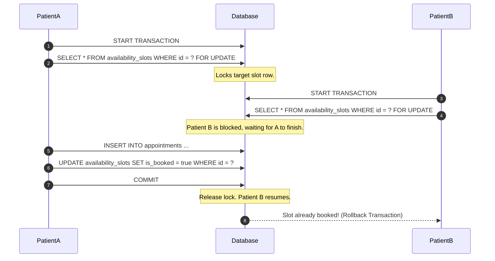
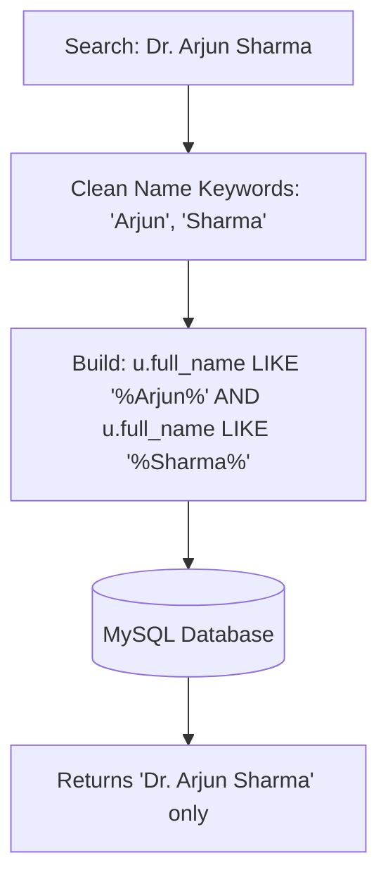

# 🏥 Booking Kro — Backend API (Express & MySQL)

Booking Kro is a production-grade, highly scalable REST API built using **Node.js**, **Express**, and **MySQL**. It powers a real-time doctor-patient appointment booking engine, implementing robust authentication, transactional safety, and comprehensive database structures.

---

## 📁 Repository Structure & Module Breakdown

```
backend/
├── src/
│   ├── config/
│   │   ├── database.js     # MySQL2 connection pooling configuration
│   │   └── swagger.js      # OpenAPI Spec (Swagger) setup for endpoint testing
│   ├── controllers/
│   │   ├── authController.js   # JWT generation, hash validation, and login routines
│   │   ├── doctorController.js # Slot CRUD, keyword-split matching search algorithms
│   │   └── patientController.js# Concurrency-safe appointment bookings, cancellations
│   ├── database/
│   │   ├── migrate.js      # Schema creation script (relational DDL queries)
│   │   └── seed.js         # Faker/JS script to populate database entities
│   ├── middleware/
│   │   ├── auth.js         # JWT interceptor and Role-Based Access Control (RBAC)
│   │   └── validate.js     # Payload parser validating incoming parameters
│   ├── routes/
│   │   ├── authRoutes.js   # /api/auth routing namespace
│   │   ├── doctorRoutes.js # /api/doctors routing namespace
│   │   └── patientRoutes.js# /api/patients routing namespace
│   ├── utils/
│   │   ├── jwt.js          # Tokens signer and encoder utils
│   │   └── response.js     # Unified format responder wrapper
│   └── server.js           # Server initializer, global middleware stacks
├── .env
└── package.json
```

---

## ⚙️ Core Architecture & Database Workflows

### 1. Concurrency-Safe Booking Engine
To prevent double-booking issues when multiple patients attempt to book the exact same slot at the same microsecond, the booking engine utilizes **MySQL Transaction isolation levels** combined with **Row-Level locks** (`FOR UPDATE`).



### 2. Keyword-Based Multi-Word Search matching
The search API splits user query inputs (e.g. `Arjun Sharma`), filters out generic pre-fixes like `Dr.` / `Dr.`, and converts search keywords into strict SQL `LIKE` criteria matching all terms.



---

## 🛠️ Tech Stack & Middleware

* **Core**: Node.js & Express.js
* **Database**: MySQL (Using `mysql2/promise` pooling)
* **Auth**: JSON Web Tokens (JWT) & bcryptjs hashing
* **Validation**: `express-validator` middleware
* **Documentation**: Swagger UI & OpenAPI

---

## 🔌 API Namespace Endpoints

### 🔐 Authentication namespace (`/api/auth`)
* `POST /api/auth/login` - Authenticates user credentials and returns JWT token.

### 👨‍⚕️ Doctor namespace (`/api/doctors`)
* `GET /api/doctors` - Fetches doctor lists with pagination (supports `name`, `specialization`, `date` filters).
* `GET /api/doctors/specializations` - Retrieves all unique medical department specializations.
* `GET /api/doctors/:id/slots` - Fetches available booking slots for a selected doctor.

---

## 🚀 Execution & Setup

1. **Configure Environment Variables**:
   Create a `.env` file in the backend root directory:
   ```env
   PORT=5001
   DB_HOST=127.0.0.1
   DB_USER=root
   DB_PASSWORD=your_password
   DB_NAME=medibook
   JWT_SECRET=super_secret_jwt_token_key
   ```

2. **Run Server**:
   ```bash
   # Install dependencies
   npm install

   # Setup database schemas and tables
   npm run migrate

   # Seed database with dummy doctors and slots
   npm run seed

   # Start backend service
   npm start
   ```